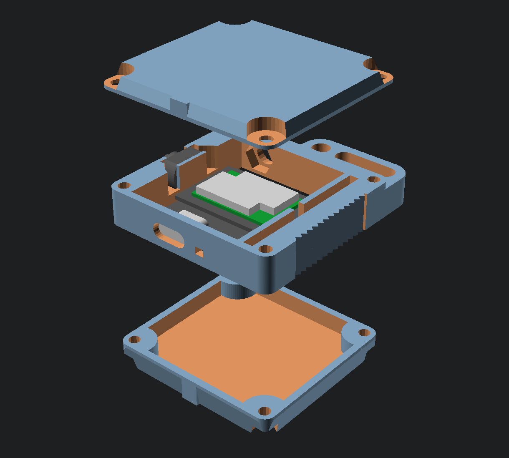

# Meshtastic RAK19003 Mini Case

A case for the RAK19003.  The dimensions of this case are adjustable to fit
various components inside.

__WARNING__: This is a work in progress.  The design is not yet complete.

## Printable Parts:

* Frame
* Front Cover (TODO)
* Back Cover (TODO)

## Hardware:
* WisBlock RAK19003 Starter Kit
* 4x M3x20 socket head cap screws
* 4x M3 Hex nuts
* 1 LiPo Battery with JST-PH connector (500-1200 mAh)
* 1 BK-1208 Pushbutton

## TODO:
* BLE antenna slot
* side grip/texture
* Lanyard hole
* On-off switch/button
* Refactor as a function of overall size
* Front cover
* Back cover
* Makefile for slicing/printing
